# DIY Passive to Active Loudspeaker Conversion 
### One hour modification of an off-the-shelf passive speaker — installing a Sonocotta Louder ESP32 controller with integrated DAC, DSP & amplifier for whole-home audio and TTS notifications with Home Assistant and Music Assistant.

*Completed modification of the Tozzi One speaker for wireless whole home audio using Home Assistant.*

---

## Table of Contents
- [What This Is](#what-this-is--and-what-it-isnt)
- [Motivation](#motivation)
- [About the Donor Speaker](#about-the-donor-speaker)
- [Features](#features)
- [Caveats & Limitations](#caveats--limitations)
- [Parts & Materials](#parts--materials)
- [Tools Required](#tools-required)
- [Build Time](#wiring-diagram)
- [Step-by-Step Build Guide](#step-by-step-build-guide)
- [What's Next](#whats-next)
- [Credits & References](#credits--references)

---

## What This Is 

- A documented modification of using off-the-shelf, readily available hardware with open source firmware (Squeezelite-ESP32) to convert a commercially available passive loudspeaker into a Wi-Fi active speaker for use with Home Assistant.
- A practical DIY guide to adding an inexpensive ESP32-based controller with integrated DAC, DSP and Class D amplifier inside an existing speaker cabinet, with options to power using USB-C, a plug-in power supply or PoE (power over ethernet).
- A DIY Home Assistant integration project implementing a Sonos alternative for whole-home, multi-room audio — streaming music and playing home automation notifications via TTS using Music Assistant.
- Part of a planned series modifying a range of speakers at multiple price points and corresponding sound quality.
  — see [What's Next](#whats-next) for planned future builds.
- **An option to purchase pre-assembled** for those wanting a commercially available speaker.

**This is NOT:**
- A project that requires wood working skills to build a speaker cabinet from scratch. 
- A smart speaker. Although the ESP32 controller has an S3 option, there is no practical means of adding a microphone to the cabinet at this time.  Stay tuned for future build this year.

---

## Motivation

You've probably found this for the same reason I did — there are no speakers purpose-built for the Home Assistant platform. Integrations exist for some name brands but require significant tinkering. Many users are publicly frustrated with the leading whole-home audio provider and actively searching for alternatives.

I wanted to replicate a Sonos-style multi-room audio setup, but without the expense and the frustrating ecosystem lock-in. I wanted something quick and easy, designed specifically for Home Assistant — whole-home audio, TTS announcements, and full integration into automations and scripts.

The next question was how to find an enclosure, simply and quickly. Many forum posts featured users experimenting with 3D-printed speaker enclosures. 3D printing is innovative but neither quick nor inexpensive, and MDF flat packs require sawing, sanding and painting.

LUCKILY, I stumbled across a speaker *KIT* — the Tozzi One — built using 3D printed components for easy assembly. The enclosure consists of a beautiful front face, box frame and a removable back panel with a tuned port for bass reproduction. The speaker was never widely adopted and was discontinued years ago, but surplus kits are still available from an online store in the UK.

---

## Caveats & Limitations

- This modification removes the original barrel connectors used to connect the speaker to an external amplifier or stereo receiver.
- You can power the Louder ESP32 via USB-C, but this limits amplifier output. A dedicated power supply is recommended for best performance.
- Using a higher voltage (12V) or more than 2A risks overheating the Class D amplifier at loud volumes and could damage the driver. Stick to 6V 2A for the Tozzi One with the CHN-50 driver.
- Speakers often benefit from "run-in" time. Tozzi One recommends playing at lower volumes for at least 100 hours before pushing levels above 50% in Music Assistant. This loosens the driver suspension, prevents early damage, and genuinely improves audio quality over time.

---

## Parts & Materials

---

Prices shown are approximate USD and include shipping, taxes and customs fees for delivery in California.

Some components sold in pairs or packages of 6 or more, as shown.

Links are for the actual product I purchased.

| #    | Component                                                    | Qty           | Price | Notes                                                        |
| ---- | ------------------------------------------------------------ | ------------- | ----- | ------------------------------------------------------------ |
| 1    | [Tozzi One Speaker Kit](https://kjfaudio.com/product/tozzi-one-kit/) | 2 cabinets    | $185  | Price varies by color choice                                 |
| 2    | [Mark Audio CHN-50 Driver](https://www.madisoundspeakerstore.com/approx-3-fullrange/mark-audio-chn50-3-magnesium-cone-full-range/) | 2             | $60   | 3" magnesium cone full-range driver                          |
| 3    | [Sonocotta ESP32 LOUDER](https://www.elecrow.com/louder-esp32.html) (with external antenna) | 1             | $40   | ESP32 with integrated DAC & amp;  **buy two if modifying both speakers** |
| 4    | [6V 2A Power Supply](https://www.amazon.com/dp/B0DP2PY3C3)   | 1             | $12   | External power supply with 2.5mm plug; **buy two if modifying both speakers** |
| 5    | [Barrel Connectors](https://www.amazon.com/dp/B0B6FFN4V5)    | 6             | $10   | Power supply connectors                                      |
| 6    | [Extended Wi-Fi Connector](https://www.bydpete.com/bpc2524ufl137b31-ipx-ufl-ufl-to-sma-female-bulkhead-waterproof-thread20mm-rf137-coaxial-cable-koax-kable-micro-coax-pigtail-jumper-p-34798.html)  (8" or longer) | 2             | $6    | IPX/U.FL to SMA female bulkhead cable the ESP32 boards come with an adapter, but it is too short for the depth of the back plate; this adapter is longer. You only need 1, but the little button connectors are easy to damage and difficult to snap onto the board. It's helpful to have a $2 spare. **buy three if modifying both speakers** |
| 7    | [Plastic Sleeves for Wi-Fi Connector Hole](https://www.amazon.com/dp/B0DNSR8TRM) | 1 pack (20)   | $12   | Supports the antenna adapter, which is much thinner than the existing hole |
| 8    | [Brass Washers for Wi-Fi Connector](https://www.amazon.com/dp/B0DW8PH7P2) | 1 pack (120)  | $6    | Larger washers to hold the antenna adapter in place          |
| 9    | [Raspberry Pi Case](https://www.amazon.com/dp/B07D57ZCX1)    | 1 per speaker | $7    | Optional to protect circuit board inside the speaker; **mandatory if you plan to ship or transport after assembly** |

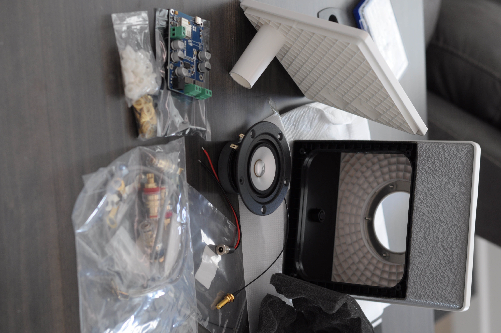
*Speaker comes in kit form - making modification easy and still quick to assemble. ESP32 and extra parts also shown.*

------

## Tools Required

- Phillips screwdrivers (regular size for panel screws and small size for circuit board)
- Longnose pliers or small socket set to secure the retaining nuts (driver and connectors)
- Wire cutter/stripper
- Rat tail file or rotary tool (Dremel) with a sanding attachment
- Scissors (cut the foam)
- Computer and USB-C cable (firmware install)

---

## Build Time

- Approximately 1 hour (or less) per speaker.
- The steps are easy and straight forward. I took my time when building the first time, but could replicate in under 30 minutes.

---

## Step-by-Step Build Guide

### Step 1 — Install the magnetic driver

1. Attach the grey foam gasket sticker to either the speaker, or the metal ring inside the enclosure. The gasket is precut. Be sure to remove the 5 little cutouts for positioning over the threaded pins on the metal ring - or over the holes on the driver. I found it easier to place and stick the gasket to the driver, but it requires patience to ensure the gasket holes line up over the driver holes. (aligning the holes will be the trickiest part of the whole build)

2. Place and tighten the threaded nuts to secure the driver.

   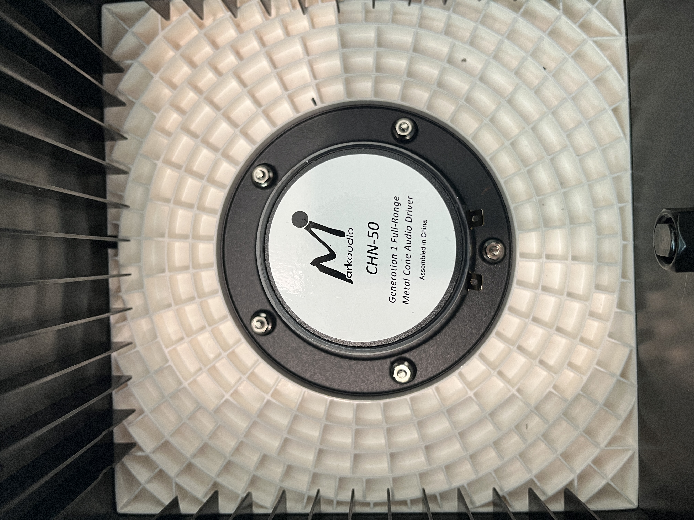
*Closeup of the driver installed inside the enclosure, with the nuts secured to the metal ring and 5 threaded posts.*

---

### Step 2 — Attach the speaker wires, Insert the foam wall padding

1. SEE PHOTO below first - showing two speaker wires. The top wire is what it will look like at the end of this step!  The bottom wire is what you will start with - in the correct orientation.
2. Carefully cut off the **ring** connectors from the speaker wire.  The ring connectors normally would attach to the external wire binding posts, but we will strip these ends to connect to the ESP32 board. Do not cut the **spade** connectors as these attach to the driver to avoid soldering.  IF YOU HAVE ANY DOUBTS, attach the wires to the driver first, to identify the **spade** connectors, and then cut off the **ring** connectors at the other end.
3. Strip 1/4" from each cut wire
4. Attach the **spade** connectors to the driver tabs.  Note the speaker polarity (very hard to see on the black paper next to the spade lugs - right side is positive (+) )
5. Test fit the "egg carton" foam inside the cabinet walls.  You will likely need to trim the length.  The ideal length is short enough to not overlap, but just a little too long so that forcing the edges together **pushes** the foam outward against the cabinet walls.  You do not need to glue or tape - the foam's extra length compresses just enough to keep the foam edges together while forcing the sides to lay flat against the walls without bulging inward.  Use a scissors to cut small amounts and test.  You can see my "seam" where the edges come together at the lower right of the cabinet, next to the extra speaker wire.

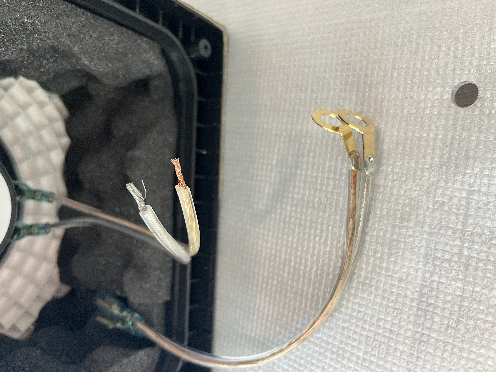
*Closeup of supplied speaker wires. Top wire has been cut, stripped and connected to the driver, by following the steps above.*

---

### Step 3 — Attach WiFi antenna connector to back panel

1. You may use either hole in the backplate (the holes that would normally have wire binding posts).
2. Slide a plastic bushings onto the connector and insert into the hole from the inside of the panel.
3. Place an oversized washer over the connector on the outside, before tightening the nut (on the outside).

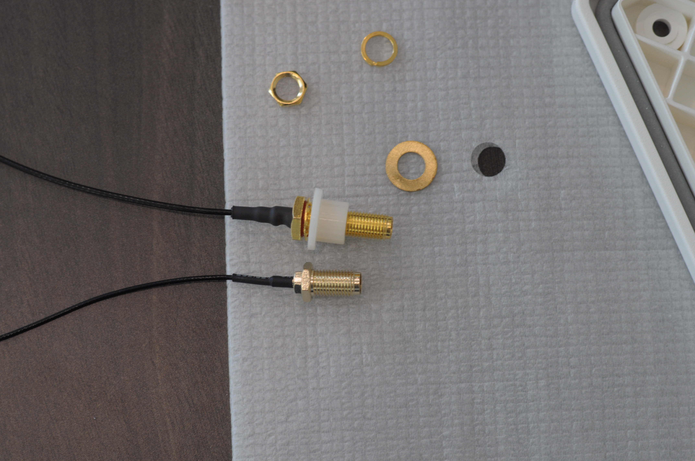
*Oversized connector on top, with the plastic bushing, ready to insert into the back plate.* 
*For comparison, the connector supplied with ESP32 is shown below it -- too short for the thick back panel.*

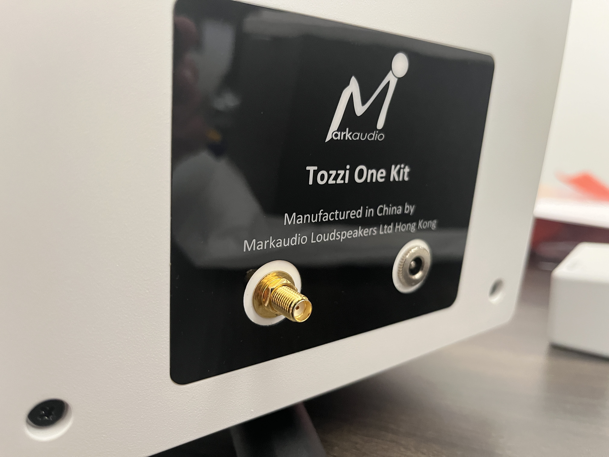

*Completed assembly of the WiFi antenna connector and the power supply connector in the next step.*

---

### Step 4 — Attach power barrel connector to the back panel

1. The existing holes are approximately 9.5mm in diameter. The barrel connector has 10.5mm diameter threads. I looked at over a dozen different suppliers in the US and China - 10.5mm was the thinnest I could find.
2. Using a **rat tail** (round profile) file, carefully file the inside of the hole, being careful to file on all sides to keep the hole as circular as possible, to widen the hole another 1mm in diameter. **If you have a rotary hand tool, use a sander, not a grinder attachment. Go slow.  Use low speeds.  No more than 10 seconds before stopping to see if the barrel fits.** Otherwise, you risk overheating and melting the plastic.
3. Install the barrel jack from the outside, and secure the nut on the inside.

---

### Step 5 — Connect the wires to the ESP32 board

1. Connect the driver wires to the ESP32 board

   a. Ensuring you connect the wire from "+" (right) driver tab to "+" connector on the board

   b.  Wire one of your drivers/speakers to the Left speaker connectors.  Wire the other driver/speaker to the Right connectors.  

   c. If you're feeling adventurous, Sonocotta provides directions to configure the DSP for a mono output (1/2 L+R)
2. Connect the power supply wires to the ESP32 board. 

   a. Be very careful to ensure you connect the wires to the correct polarity on the board. 

   b. Most power supplies provide "+" to the center post - but some will reverse them.
3. Connect the WiFi cable to the ESP32 board. 

   a. These connectors are tiny and a bit tricky.

   b. As best you can, lay the button connector perfectly flat on top of the little pin on the ESP32

   c. Use your finger nail or a small screwdriver head to gently place pressure straight down onto the top of the connector

   d. You will hear it "click" into place.  It does not take much pressure - do not apply too much pressure. **note - I had one cable with a damaged connector that refused to click into place. I threw it out and used another cable - thankfully these are really inexpensive**
4. Optional - if you intend to protect the ESP32 with an RPi case, insert and mount it now.

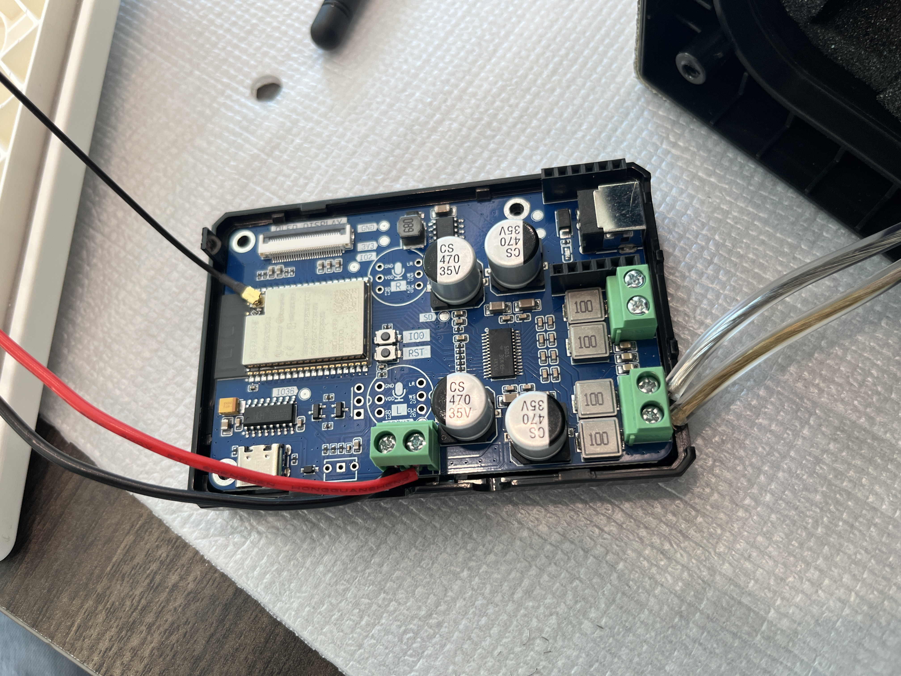
*Driver wires, power cable and WiFi cable connected to the ESP32 board in a Raspberry Pi case for protection.*

---

### Step 6 — Flash the ESP32 controller with Squeezelite firmware

This project uses **Squeezelite-ESP32** firmware for seamless Home Assistant integration via Music Assistant. Squeezelite is an open source audio player that streams directly to Music Assistant without requiring ESPHome or YAML configuration.

1. Connect a USB-C cable to the ESP32 board and your pc or laptop

2. Open the web-based firmware installer: https://sonocotta.github.io/esp32-audio-dock/

3. Scroll to the section for **Louder-ESP32 Boards**, click on the box labeled **32-bit (High Quality)**

   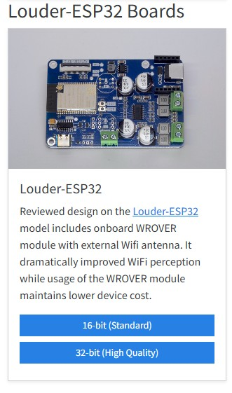

4. Select option to **Install Louder-ESP32-32Bit** follow the prompt to **Install** and wait 2-3 minutes as it proceeds

   

5. After firmware installs, return to the menu above, 

   a. select **Logs & Console**

   b. select **download the log** to your laptop (handy - but not necessary - to have for review later)

   c. keep the log open for next step - you can see what IP address it acquires which you will need later

6. Using a mobile device (phone, tablet, etc.), 

   a. connect your mobile device to the board's WiFi SSID: louder-esp32

   b. open a browser and enter: https://192.168.4.1 

   c. using the Louder-ESP32 GUI menu, select your home WiFi, enter the WiFi password, select **Join**

   d. click Save, connect your mobile device back to your home WiFi SSID

   e. open a browser and enter the IP address assigned in the log (look for 3 green lines like below)

   f. click on the **Exit Recovery** button near the bottom of the page.

---

### Step 7 — Test Before Closing Up

1. Use your mobile device to test connecting to the louder-esp32 device via Bluetooth as a quick audio check
2. Open Home Assistant / Music Assistant

   a. Go to Player Settings

   b. Confirm the louder-esp32 Squeezelite player appears

   c. Add as a new player

   d. Stream a song or play a TTS notification to confirm audio output

   e. Test by changing volume, pausing, and resuming to verify full media player control

---

### Step 8 — Final Assembly

1. Trim the square egg foam to lay against the back plate.  This square should be a little larger than the hole created by the egg foam surrounding the inside walls of the cabinet.  I also cut a small circle in the corner around the bass port. **note - I eventually removed this foam square - I felt the midrange sound quality was better without the back plate foam**
2. Trim and insert the grey silicone gasket into the recessed edge of the back panel (this seals the cabinet for better sound)
3. Optional - Close the RPi case cover if using
4. Slide the board or RPi case along side the driver, ensuring you **do not twist the wires or strain the WiFi cable**
5. Carefully fit the back plate onto the cabinet - before rotating the cabinet onto its face - and then secure the screws. **note - I found it easier to keep the board and foam in place, without stretching the wires - if I closed the back plate with the cabinet vertical instead of laying on its face. If you leave out this foam, you have room to place the board/RPi case against the back plate, instead of along the side of the driver.**

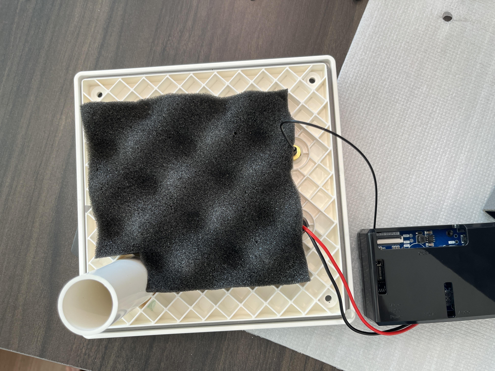
*Trim foam for back, cutting around the bass port. Wires fit between foam square and the foam surrounding the cabinet walls.*

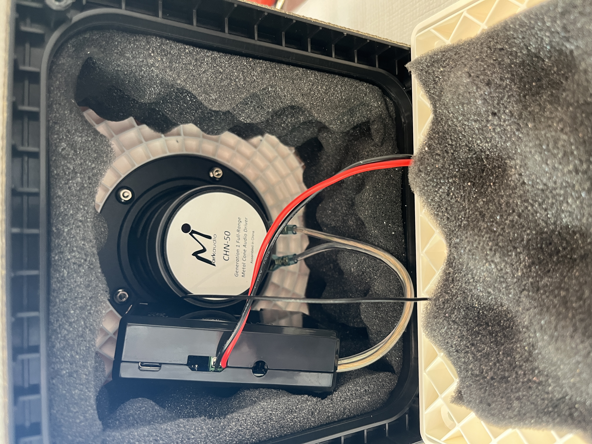
*Slide the ESP32 or RPi case along the side of the cabinet if using back plate foam.*

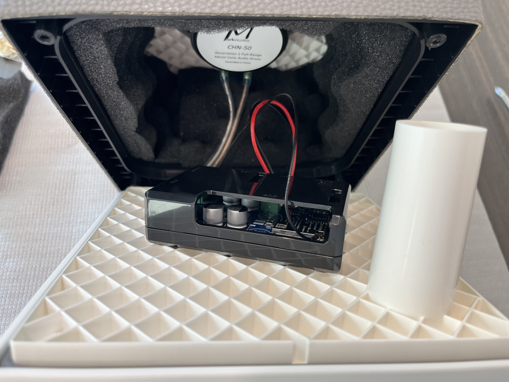
*Not using back plate foam? You can let the RPi case rest vertically against the back plate.*

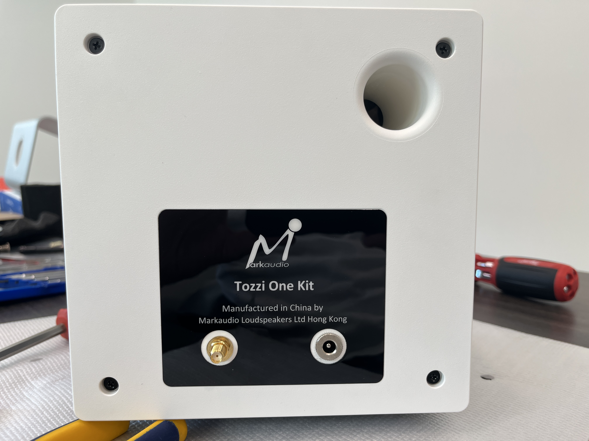
*Completed speaker with the back plate secured to the cabinet by four screws.*

---

## What's Next

This is **Build #1** in a planned series of passive-to-active speaker conversions — a DIY Sonos alternative using ESP32 and Music Assistant across multiple rooms.

| Build | Speaker | Status |
|-------|---------|--------|
| #1 | Tozzi One + Sonocotta Louder ESP32 | ✅ Complete |
| #2 | Low-end, low-cost (sub $50) mini-speaker | 🔜 April 2026 |
| #3 | Mid-range, mid-cost (sub$100), 2-way speaker | 🔜 May 2026 |
| #4 | Smart speaker option | 🔜 June/July 2026 |

**Features planned for future builds:**
- Conventional black wood grain cabinets with black cloth grilles
- Custom printed back plates, sized for each power option (USB-C, PoE)
- Option to pair a second speaker with 1 wire connecting the passive speaker.
- DAC & Amplifier upgrades, higher power delivery (Louder ESP32 Plus)

---

## Credits & References

- [Sonocotta Louder ESP32 Documentation](https://github.com/sonocotta/esp32-audio-dock)
- [Squeezelite-ESP32 Firmware](https://sonocotta.github.io/esp32-audio-dock/)
- [Music Assistant for Home Assistant](https://music-assistant.io/)
- [Home Assistant Media Player Integration](https://www.home-assistant.io/integrations/media_player/)
- 

---

*Build #2026-03-14| [Your Name] — [Year]*
